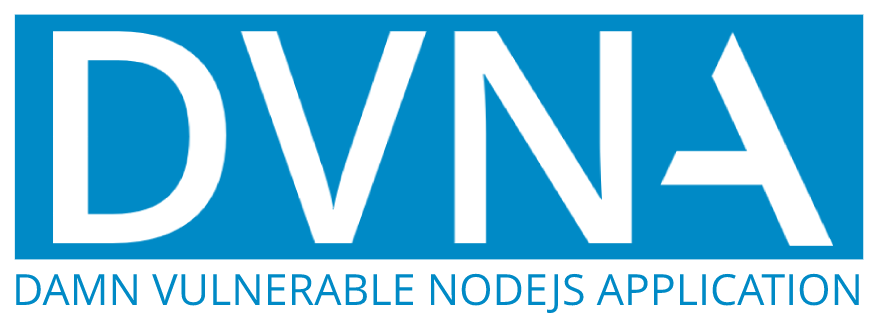

# Damn Vulnerable NodeJS Application (DVNA)



Damn Vulnerable NodeJS Application (DVNA) is a simple NodeJS application to demonstrate [**OWASP Top 10 Vulnerabilities**](https://www.owasp.org/index.php/Top_10-2017_Top_10) and guide on fixing and avoiding these vulnerabilities. The [fixes](https://github.com/appsecco/dvna/tree/fixes) branch will contain fixes for the vulnerabilities. Fixes for vulnerabilities OWASssP Top 10 2017 vulnerabilities at [fixes-2017](https://github.com/appsecco/dvna/tree/fixes-2017) branch.

The application is powered by commonly used libraries such as [express](https://www.npmjs.com/package/express), [passport](https://www.npmjs.com/package/passport), [sequelize](https://www.npmjs.com/package/sequelize), etc.

## Developer Security Guide book

The application comes with a **developer friendly comprehensive guidebook** which can be used to learn, avoid and fix the vulnerabilities. The guide is available at [docs](/docs) and covers the following

1. Instructions for setting up DVNA
2. Instructions on exploiting the vulnerabilities
3. Vulnerable code snippets and instructions on fixing vulnerabilities
4. Recommendations for avoid such vulnerabilities
5. References for learning more

The blog post for this release is at [https://blog.appsecco.com/damn-vulnerable-nodejs-application-dvna-by-appsecco-7d782d36dc1e](https://blog.appsecco.com/damn-vulnerable-nodejs-application-dvna-by-appsecco-7d782d36dc1e)

You can setup a local gitbook server to access the documentation using the following commands. The documentation will then be accessible on [http://localhost:4000](http://localhost:4000).

```bash
cd docs/
docker run --rm -v `pwd`:/gitbook -p 4000:4000 --name gitbook amontaigu/gitbook gitbook serve
```

## Quick start

Try DVNA using a single command with Docker. This setup uses an SQLite database instead of MySQL.

```bash
docker run --name dvna -p 9090:9090 -d appsecco/dvna:sqlite
```

Access the application at [http://127.0.0.1:9090/](http://127.0.0.1:9090/)

## Getting Started

DVNA can be deployed in three ways

1. For Developers, using docker-compose with auto-reload on code updates
2. For Security Testers, using the Official image from Docker Hub
3. For Advanced Users, using a fully manual setup

Detailed instructions on setup and requirements are given in the Guide Gitbook

### 1. Development Setup

Clone this repository

```bash
git clone https://github.com/appsecco/dvna; cd dvna
```

Create a `vars.env` with the desired database configuration

```bash
MYSQL_USER=dvna
MYSQL_DATABASE=dvna
MYSQL_PASSWORD=passw0rd
MYSQL_RANDOM_ROOT_PASSWORD=yes
```

Start the application and database using `docker-compose`

```bash
docker-compose up
```

Access the application at [http://127.0.0.1:9090/](http://127.0.0.1:9090/)

The application will automatically reload on code changes, so feel free to patch and play around with the application.

### Using Official Docker Image

Create a file named `vars.env` with the following configuration

```bash
MYSQL_USER=dvna
MYSQL_DATABASE=dvna
MYSQL_PASSWORD=passw0rd
MYSQL_RANDOM_ROOT_PASSWORD=yes
MYSQL_HOST=mysql-db
MYSQL_PORT=3306
```

Start a MySQL container

```bash
docker run --rm --name dvna-mysql --env-file vars.env -d mysql:5.7
```

Start the application using the official image

```bash
docker run --rm --name dvna-app --env-file vars.env --link dvna-mysql:mysql-db -p 9090:9090 appsecco/dvna
```

Access the application at http://127.0.0.1:9090/ and start testing!

### Manual Setup

Clone the repository

```bash
git clone https://github.com/appsecco/dvna; cd dvna
```

Configure the environment variables with your database information

```bash
export MYSQL_USER=dvna
export MYSQL_DATABASE=dvna
export MYSQL_PASSWORD=passw0rd
export MYSQL_HOST=127.0.0.1
export MYSQL_PORT=3306
```

Install Dependencies

```bash
npm install
```

Start the application

```bash
npm start
```

Access the application at [http://localhost:9090](http://localhost:9090)

## TODO

- [ ] Link commits to fixes in documentation
- [x] Add new vulnerabilities from OWASP Top 10 2017
- [x] Improve application features, documentation

## Contributing

In case of bugs in the application, please create an issue on github. Pull requests are highly welcome!

## Thanks

[Abhisek Datta - abhisek](https://github.com/abhisek) for application architecture and front-end code

## License

MIT
